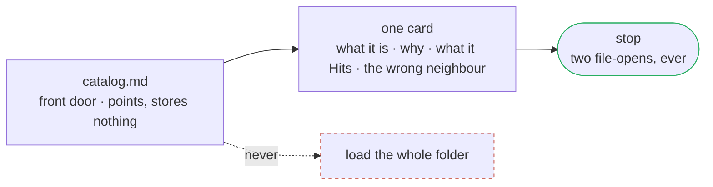

# Wayfinder Cartographer

Point it at a body of work (a repo, a database, an automation folder, a vault). It leaves behind a map that the next person, or the next AI, can use to change that system safely without reading all of it.

**Before.** To safely change the HFS sync, you read 183 files or booked a two-hour call with whoever built it.
**After.** You open the catalog, read one card, and make the change. Two files.

The people who get paid are the ones who can hand off a system that way. That's what this builds. It works the same whether the next reader is a person or an AI.



Every card is tagged **live** (running), **leftover** (kept but dead), or **ghost** (looks real, is not). The tag comes from evidence, not from the name.

**See it work in 60 seconds.** Drop the `map-hfs-sync/` folder into any AI that has never seen your system. Ask it:

> "Using only this folder, what breaks if I change the SQL query, and what does it NOT touch?"

It answers from one card (`sql-source`) and stops. A stranger, person or model, gets the answer without loading the rest. That's the product.

It doesn't tell you why something broke. That's a diagnostician. It doesn't walk you through the whole thing. That's a tour. It gives you a front door and one card at a time.

## What it has mapped

It's a mapmaker, not one map. It has built a map for five different kinds of system, and every one passes the verifier.

- **`map/`** is the Render Factory. A multi-table slice of an Airtable base (buyer selections turn into rendered video).
- **`map-margin-analysis/`** is a single 112-field table, where a "noun" is a cluster of fields.
- **`map-hfs-sync/`** is an n8n automation folder. 183 files, and only about 4 are the live system.

It has also been run cold, by a fresh session with no memory, on an outside code repo and an Obsidian vault (see `CHANGELOG.md`). Five kinds of system in all. It works the same on all of them. The only thing that changes per system is how you set up the verifier's ground truth.

> A note on the examples. The live infrastructure ids are masked. The Airtable base, table, and field ids are swapped for example ids (`tblEXAMPLE…`), and an n8n host and two credential ids are shown as `[…]`. Everything else is real: the table and field names, the file paths, the line numbers, the record counts.

## What to feed it

A body of work that is still in use and that someone is going to change. A repo, a vault, an automation pack, a client-delivery folder, or a slice of a database. Don't feed it something that broke. Don't feed it the method itself.

## How a cold model should walk this folder

Load these in order. Don't load everything.

1. `identity.md`. Who the Cartographer is, and who the later reader is.
2. `rules.md`. How it maps. Inventory first, tag live / leftover / ghost, cite the source, write Hits and Does not hit.
3. `reference/card-types.md`. The fixed set of card types.
4. Then make the map for the target, or read one that's already here.

To read a finished map in this repo, open `map/catalog.md` first (the front door). Then open exactly one file in `map/cards/`. Then stop. Two files, ever. Never open the whole `map/cards/` folder at once. That's the rule.

`examples.md` is a flat preview with every card in one file, there for easy reading. It's the tour, not the thing you load. The map you actually walk is `map/`.

## The one rule

Open `map/catalog.md`, then one card in `map/cards/`, then stop. If anything here tells you to add every file to the project, it's wrong. It doesn't.

## In ICM terms

This is the ICM system-map form. The catalog is the front-door index. It points, and stores almost nothing. The cards are the objects. `Hits` and `Does not hit`, plus the catalog warnings, are the effects index, and they live on the noun so they can't drift from a separate file. The change-walks show the process. `verify/source-index.json` is a derived index. It's generated, never typed by hand. `examples.md` is a derived flat view of `map/`, rebuilt by `verify/build-examples.mjs`. It was built to this form by hand, then checked against the ICM Architect skill.

## Verify a map

A map in this repo is checked by a script, not taken on trust, and the checks run on every push.


The checker is Node, with nothing to install.

```
node verify/verify_map.mjs map examples.md
```

It fails if a card cites a table or field the real base doesn't have, if a ghost is tagged live, if a "N records" count disagrees with the source, if the walk tells a reader to load the whole source, if one card file holds more than one card, or if the catalog embeds a full card instead of pointing at one. The negative fixtures that MUST fail live in `verify/fixtures/`, one per failure mode.

```
node verify/verify_map.mjs verify/fixtures/fail_ghost-by-name.md    # expect exit 1
node verify/verify_map.mjs verify/fixtures/fail_field-invented.md   # expect exit 1
node verify/verify_map.mjs verify/fixtures/fail_slurp-negation.md   # expect exit 1
node verify/verify_map.mjs verify/fixtures/fail_heading-dodge.md    # expect exit 1
```

`verify/source-index.json` is the ground truth the checker reads: the real table and field ids and names from the base, the record counts, and the list of proven ghosts. `verify/blind-run-01.md` is the cold-reader run that broke the first version, and what got changed because of it.

**Coverage (for folder maps).** The checks above prove that what's in the map is sound. Coverage proves the map is complete. Run `node verify/coverage.mjs <map-dir> <folder-key>`. It fails unless every real file is accounted for: named in a card, claimed by a card's `**Covers:** <glob>` line, listed as a ghost, or excluded with a reason. Example: `node verify/coverage.mjs map-hfs-sync hfs-airtable-mapping`.

## What the later reader can do, cold

1. Find the front door from the catalog.
2. Open one card and know what the thing is and why it's shaped that way.
3. Name what else moves if they change it, and the obvious wrong neighbour.
4. Stop, without loading the rest.
